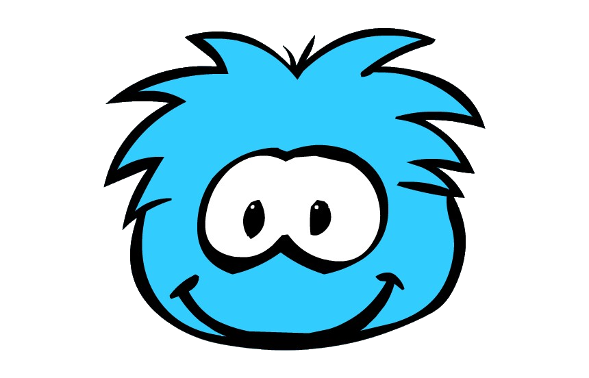

# Hi! 👋

My name is Leo and I'm a Computer Science student by UFJF.

- 👨‍💻 Enthusiast of Web Developmnet learning
- 🎯 Challenging myself to create systems integrating backend and frontend
- 🧠 Learning and researching about neuroscience and BCI
---

&nbsp;
&nbsp;
&nbsp;
&nbsp;
&nbsp;
&nbsp;
&nbsp;  

---

