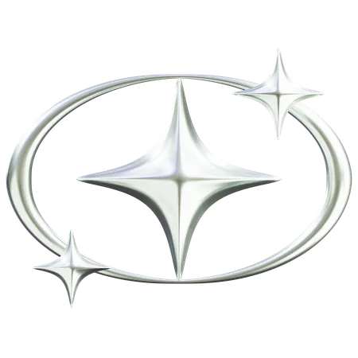

 
 
 
 
 

Hi! I'm Leo 👋

I am a Computer Science student at the Federal University of Juiz de Fora (UFJF) with a strong passion for web application development. Currently pursuing my degree, I am deeply engaged in learning and applying technologies such as Node.js, React, and Next.js.

## About Me

- 🎓 Studying Computer Science at UFJF, focusing on web technologies and software engineering.
- 💻 Proficient in Node.js for backend development and React/Next.js for frontend development.
- 🌟 Always eager to take on new challenges and opportunities to enhance my skills.
- 🚀 Passionate about contributing to innovative projects that push boundaries and solve real-world problems.
- 🧠 Learning and researching about neuroscience and BCI
---

&nbsp;
 &nbsp;
&nbsp;
&nbsp;
 &nbsp;
&nbsp;
&nbsp;

---

